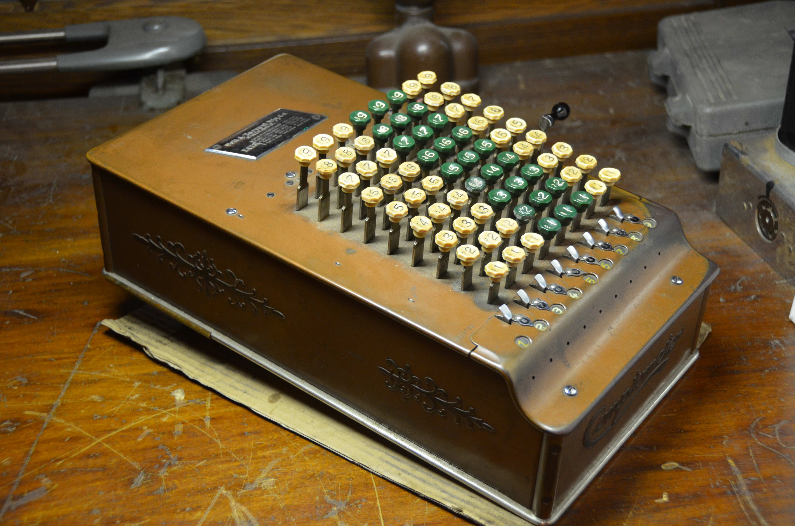
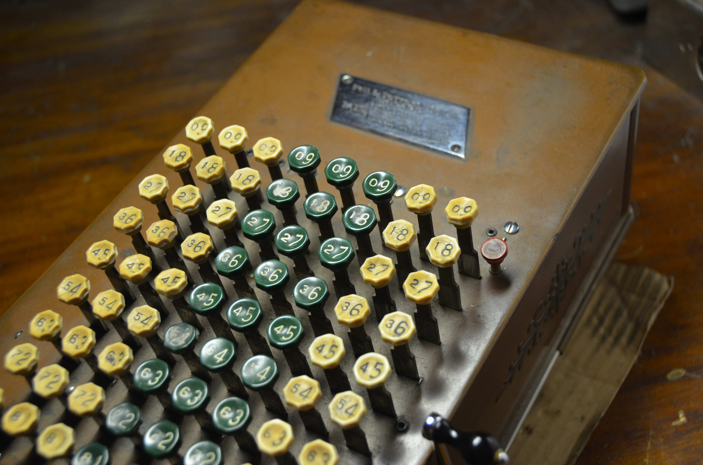
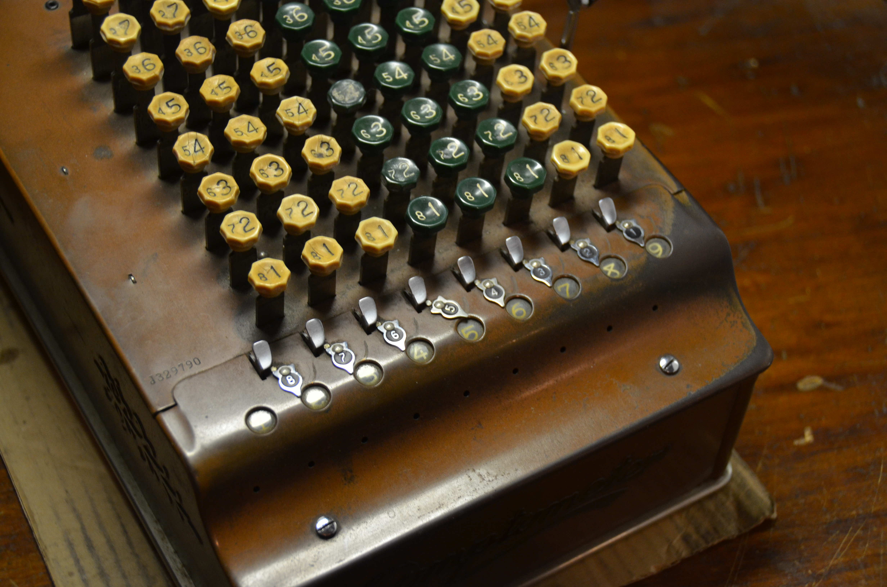
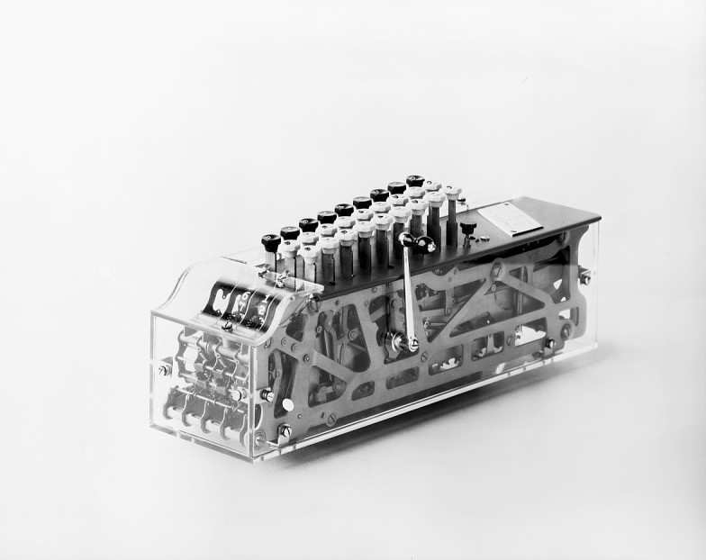

## Overview 

{:refdef: style="text-align: center;"}
{:.shadow}
{: refdef}

The *Felt & Tarrant Manufacturing Company*, established in 1889, was the leader in key-driven adding machines during the 20th century. The machines manufactured by the company were produced and marketed under the Comptometer name. The primary goals of the machines were speed and accuracy for numbers that needed to be added in rapid succession. The Comptometers quickly gained popularity and many models were produced throughout the years. This particular model is a model *J* (serial J329790). The model *J* began production in 1926 and continued through 1939. The machine is nearly identical in appearance to previous models such as the model *H*,  however, there were a few small internal changes - such as a more reliable clearing mechanism, small changes to the carry mechanism, and more reliably calibrated springs. 

{:refdef: style="text-align: center;"}
{:.shadow}
{: refdef}

Model *J* machines were produced specific currencies or simply normal 0-9 values and in varying sizes. 

{:refdef: style="text-align: center;"}
{:.shadow}
{: refdef}

This particular model had an 8 column keyboard with a nine digit register. The register keys are in green and white, with the compliment of the key digit in a smaller font to the left of the main digit. A small red key at the top right of the machine engages or disengages the safety mechanism preventing any key presses of a key is only half depressed. On the right side of the machine is lever for clearing the register.

{:refdef: style="text-align: center;"}
{:.shadow}
{: refdef}

The register has little swinging decimal place indicators for eight of the digits. A small button above the digits, if pressed, disengages the tens carry mechanism for the next digit.

## Basic Mechanism

{:refdef: style="text-align: center;"}
{:.shadow}
{: refdef}

This is an image of the basic Comptometer mechanism (Credit - MechanicalComputing, YouTube). The primary mechanism consists of a long long metal bracket, with teeth on the front end at the register and pivoted from the rear of the machine. A spring keeps tension on the bracket, pulling it upwards. Depressing a key pushes the bracket down and due to the placement of the keys from the rear pivot point, a key closer to the pivot point moves the bar farther downwards than a key farther from the pivot point. The key distance from the pivot point, determines how far down the bracket travels, and thus how many teeth engage the gear the in the register. Pressing nine on the keyboard pushes the bracket down the most, and thus more teeth engage and rotate the register gearing. The register gear is ratcheted to where only upwards motion from the teeth on the bracket rotate the register mechanism. 

Different models added more features, such as safety interlocks to prevent a key from only being partly depressed. The register mechanism also varied between machines and included a tens carry and clearing mechanism. 

The mechanism of the model *J* with added safeties and register mechanism can be seen in this cutaway produced by the company in 1928. (Smithsonian)

{:refdef: style="text-align: center;"}
{:.shadow}
{: refdef}

## Operation

Adding machines differ in operation from other calculators discussed on this blog so far. It can perform all four functions - addition, subtraction, division, and multiplication - although the process is more involved for anything other than addition. 

### Addition

 For addition, simply depress and release the number that should be added. Keys can depressed in different columns at the same time. Numbers can also be entered in rapid succession. A skilled operator using both hands could easily add up hundred of numbers remarkably quickly. 

### Subtraction

 For subtraction, the smaller complimentary keys on the key caps are utilized. The number to be subtracted from must be in the register. Then mentally subtract one from the number you want to subtract. Then, depress the keys with that number using the complimentary digits on the keys. Since subtraction on adding machines is just adding compliments, the tens carry will still propagate. Meaning, the column to the left of the digit being subtracting will be increased and should be ignored. Or alternatively, the carry disengage button should be pressed above the leftmost digit. If subtracting a number with less digits than the number in the register, leading zeros should also be depressed to get the same number of digits as is in the register.

 For example, to subtract 22 from 33, first add 33 into the register. Next, mentally subtract 1 from 22, resulting in 21. Then, using the compliment digits, enter 21 in the columns above 33. The result will now be in the register, with any digits to the left of the initial number ignored.

 Another example, subtract 25 from 625. Press 625 to place the number in the register. Next, mentally subtract 1 from 25, resulting in 24. Since the number we are subtracting from has 3 digits, a leading zero should be added to 24, making it 024. Pressing this on the keyboard will subtract 25 from 625. 

### Multiplication

 For multiplication, repeated addition is used. To multiply a number by a single digit, simply press that number as many times as the multiplier in the same columns. So to multiply 12 x 5, press 12 on the keyboard 5 times.

 To multiply numbers with more place values, the number must be shifted and multiplied by the number corresponding with that place value. So, to multiply 12 times 25, enter 12 on the keyboard 5 times for the ones place in the multiplier. Then, shift left one column and enter 12 two times for the tens place value. 

### Division

 For division, add the dividend using the leftmost position on the keyboard to enter the number in the register. Next, subtract one from the divisor mentally and enter that number on the keyboard using compliments. Enter the divisor until the divisor is larger than the result displayed directly below it in the register. When it is larger, shift one place right, and repeat until you cannot shift right anymore, or the divisor can be subtracted evenly. 

## More Pictures

{:refdef: style="text-align: center;"}
{:.shadow}
{: refdef}

Comptometer logo. The holes in the register plate above are for oiling.

{:refdef: style="text-align: center;"}
{:.shadow}
{: refdef}

Zeroed register. Note the digits are slightly not aligned in the window. 

{:refdef: style="text-align: center;"}
{:.shadow}
{: refdef}

Digit just entered.

{:refdef: style="text-align: center;"}
{:.shadow}
{: refdef}

Machine side.

{:refdef: style="text-align: center;"}
{:.shadow}
{: refdef}

Patent information.