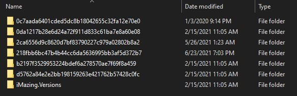

## Background

This is a tool I wrote three years ago, but had to use again a few days ago and thought I would make a write up about it. So, growing up in a family of 7 and being the one most interested in technology meant I became tech support for my family. As the oldest sibling, I would teach my siblings how to use computers, phones, and iPods. I would also help my parents at handling my sibling's technology. One day, my mother came to me asking if I could get a forgotten passcode for her off one of my youngest sibling's iPod. Surprisingly though, it wasn't the device passcode - it was the passcode to the restrictions.

## iOS Restrictions Passcode

Apple allows restrictions to be setup on their devices. The primary use of these is for parental control - such as disabling installing apps or disabling 18+ music downloads. The restrictions require a separate password be set for access to the restrictions control page. If this code is forgotten, there is no way to recover it. Typically, the device would have to be reset. I didn't exactly want to reset the device, so my goal was to find or crack the restrictions passcode.

### Where to find it?

That's what I wanted to find out. First, I grabbed my jailbroken device and started browsing around the file system. Since the passcode is entered directly into a page in settings, I started looking there hoping I could find a base64 encoded passcode or something simple. Under `/var/mobile/Library/Preferences` is a property list file called `com.apple.restrictionspassword.plist`. Hm. `restrictionspassword`? Sounds like what I was after. This file contains a single dictionary, with two data keys: `RestrictionsPasswordKey` and `RestrictionsPasswordSalt`. It looked like this:

```
<?xml version="1.0" encoding="UTF-8"?>
<!DOCTYPE plist PUBLIC "-//Apple//DTD PLIST 1.0//EN" "http://www.apple.com/DTDs/PropertyList-1.0.dtd">
<plist version="1.0">
<dict>
	<key>RestrictionsPasswordKey</key>
	<data>
	+ELsJPG2ko6AHAK3KZe/uooMFR8=
	</data>
	<key>RestrictionsPasswordSalt</key>
	<data>
	R9C4DA==
	</data>
</dict>
</plist>
```

Okay, so now I had a hash and a salt. Next is to figure out what kind of hashing algorithm this is. Thankfully, someone on the [hashcat](https://hashcat.net/forum/thread-2892.html) forums had this same question, and somebody answered.  

{:refdef: style="text-align: center;"}
{:.shadow}
{: refdef}

So, this user states that the hashing algorithm is `pbkdf2-hmac-sha1 ((Password-Based Key Derivation Function 2)`.  Since this is a hashing function it needed to be bruteforced. Thankfully, the iOS restrictions only allow for a four digit code to be set as the passcode. So the keyspace is only 0000-9999 which seemed easy enough to bruteforce.

### How to get the file though?

First I had problem though. My sibling's iPod was not jailbroken. So how do we get to this file? Hmmmmm. With some Googling, I learned the restrictions passcode is placed back on the device after a backup and restore. This meant the file or at least the hash and salt definitely is copied to the computer during a backup. This seemed like a good way to find the file. 

So, I made a backup of the iPod and my iPhone with a restrictions set in case there were changes across devices or versions in how the hash and salt is copied over. Backups were made using iTunes. On Windows, backups are stored at `C:\Users\<user>\AppData\Roaming\Apple Computer\MobileSync\Backup`. On Mac, they are stored under `/Library/Application Support/MobileSync/Backup/`. In this folder are the different backups, even if it doesn't look like it at first.  

{:refdef: style="text-align: center;"}
{:.shadow}
{: refdef}

Inside the folders that are a backup of a device, there is an `Info.plist` file that eventually contains the device name and information.

```
...
<key>Build Version</key>
	<string>18C66</string>
	<key>Device Name</key>
	<string>iPod touch</string>
	<key>Display Name</key>
	<string>iPod touch</string>
	<key>GUID</key>
	<string>REDACTED</string>
	<key>Installed Applications</key>
	<array>
		<string>com.fingersoft.hillclimbracing2</string>
		<string>com.fboweb.MyRadar</string>
	</array>
	<key>Last Backup Date</key>
	<date>2021-02-09T20:26:38Z</date>
	<key>Product Name</key>
	<string>iPod touch</string>
	<key>Product Type</key>
	<string>iPod9,1</string>
	<key>Product Version</key>
	<string>11.3.1</string>
	<key>Serial Number</key>
	<string>REDACTED</string>
	<key>Target Identifier</key>
	<string>REDACTED</string>
	<key>Target Type</key>
	<string>Device</string>
	<key>Unique Identifier</key>
	<string>REDACTED</string>
	<key>iTunes Files</key>
	<dict>
...
 ```

Now I could find my devices. 

Since I knew that hash that was on my iPhone, I used that and searched through the iPhone backup contents. 