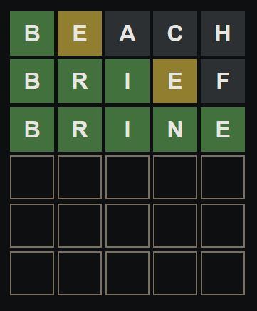
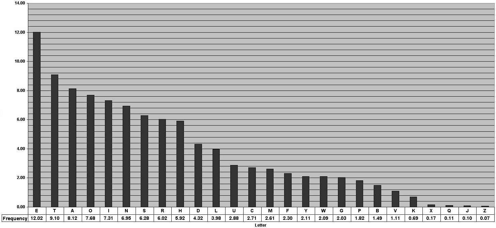

## What's Wordle?

{:refdef: style="text-align: center;"}
{:.shadow}
{: refdef}

Wordle is a small online game that has blown up in popularity recently. It's premise is simple, you have six tries to guess a five letter word. I'm going to call this the target word. Each guess reveals information about the target word. If a letter you guessed is at the same place in the target word, it's square in the grid is colored green. If the letter is in the target word but it in the incorrect place, the square is colored yellow. And finally, if the letter is not in the target word the square is blank with no color. 

In the example image above, the first word I guessed was *beach*. "B" is colored green, so the target word starts with a "B". "E" is colored yellow, so the letter "E" is in the word, but is not the second letter in the word. "A", "C", and "H" are not found anywhere in the target word. The next word I guess is *brief*. "B" is the first letter and the letter "E" is in the word and not in the second place. I got lucky and go too more letters that are in the correct space: "R" and "I". The "E" is yellow, so the only other place it can be is the last place. Now we only have to guess one more letter. And from the other guesses we know that "B", "E", "A", "C", "H", and "F" are not letters that can be in the next to last place. My final guess was the word *brine*. All the squares are green, and that was in fact the target word. 

## How can we solve Wordle more efficiently? Frequency analysis. 

Frequency analysis is used to determine the frequency of individual letters in the English language. This is shows us what letters are used more frequently than others, for example, the letter "A" is more common in words than "Z". This can be used for solving a Wordle by guessing the most likely word with the information returned from previous guesses. Thankfully, a frequency analysis of all English letters already exists.

{:refdef: style="text-align: center;"}
{:.shadow}
{: refdef}

