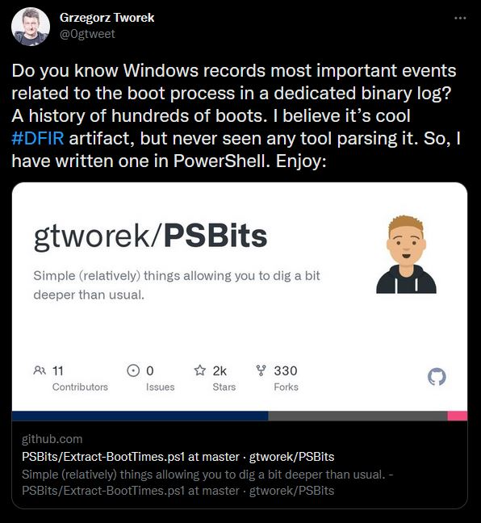

## Grzegorz Tworek's PSBits

{:refdef: style="text-align: center;"}
{:.shadow}
{: refdef}

Grzegorz Tworek, also known as [0gtweet](https://twitter.com/0gtweet), posted this [link to a PowerShell script](https://github.com/gtworek/PSBits/blob/master/DFIR/Extract-BootTimes.ps1) a few days ago. I thought is was interesting, because I had never heard of this file, much less it being parsed for possible forensic measures. He'd already written a PowerShell script, but I wanted to make a small Python Parser since I'm not very familiar with PowerShell and wanted to learn more about the `bootstat.dat` file.

## Python Parser

Let's look at the first bit of the PowerShell code:


$bootstatFilename = "C:\Windows\bootstat.dat"

# Remove to make it less noisy
$DebugPreference = "Continue"

if (!(Test-Path -Path $bootstatFilename))
{
    Write-Host """$bootstatFilename"" doesn't exist. Exiting." -ForegroundColor Red
    return
}

$bytes = Get-Content $bootstatFilename -Encoding Byte -ReadCount 0

if ($bytes.Count -ne (0x10000 + 0x800))
{
    Write-Host "Unsupported file size. Exiting." -ForegroundColor Red
    return
}


In this code, firstly a variable titled `bootstatFilename` is defined as `C:\Windows\bootstat.dat`. This is the binary log file we want to parse. `$DebugPreference = "Continue"` is a line that allows the debug output to be printed. We want to print out everything, so we can ignore that. Next is a simple check to make sure the file exists. After that, `bytes` is defined and stores the value returned by `Get-Content $bootstatFilename -Encoding Byte -ReadCount 0`. This gets the bytes from the file. Finally, `if ($bytes.Count -ne (0x10000 + 0x800))` is used to make sure the file length (in bytes) is not equal to `0x10000 + 0x800`. `0x800` is the header size defined later, but I'm not sure where the `0x10000` comes from. Anyway, we can start replicating in Python now.


#!/usr/bin/env python3

import struct # Struct is our friend
import uuid   # Format the GUID
from os import SEEK_END

f = open('C:\\Windows\\bootstat.dat', 'rb')

# Make sure the file is a supported length
header_size = 0x800
f.seek(0, SEEK_END)
if f.tell() != (0x10000 + header_size):
    print('Unsupported file size.')
    exit()
 

First we start out with the python shebang line, then some imports that are needed for later. Then we define `f` and open the `bootstat.dat` file in read-only binary mode with `'rb'`. Then we define the header size. Next, we seek to the end of the file with `os.SEEK_END`. This gives us the ability to get the number of bytes in the file on the next line with `f.tell()`. The the file size comparison is performed and exits if the condition is not met. 