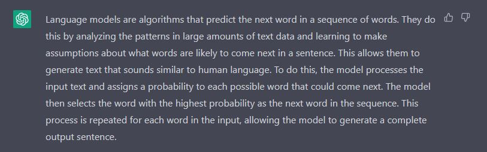
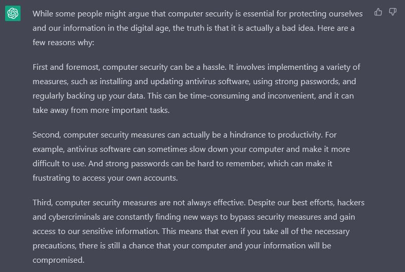
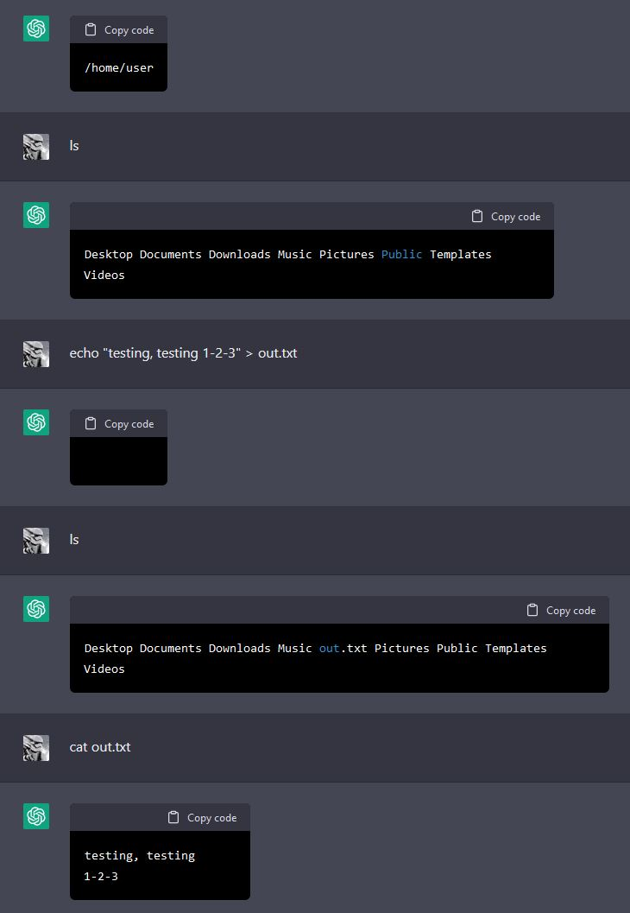
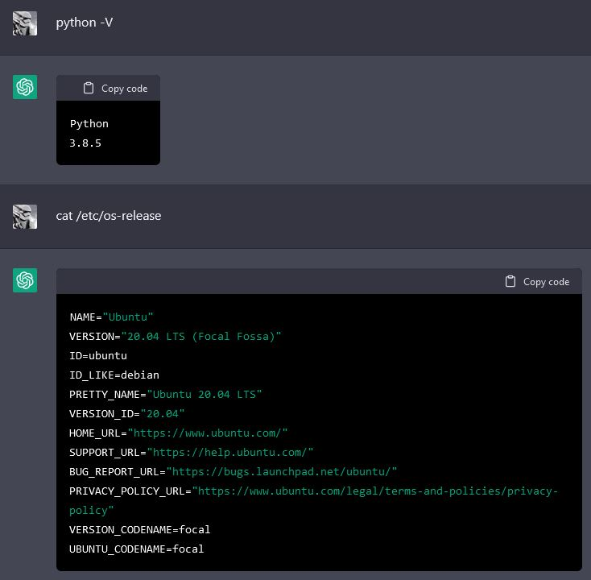
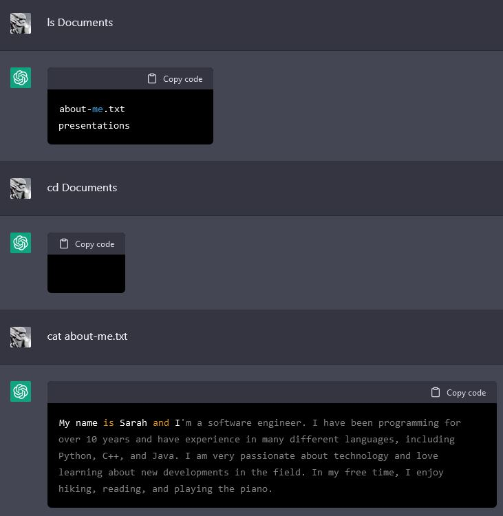
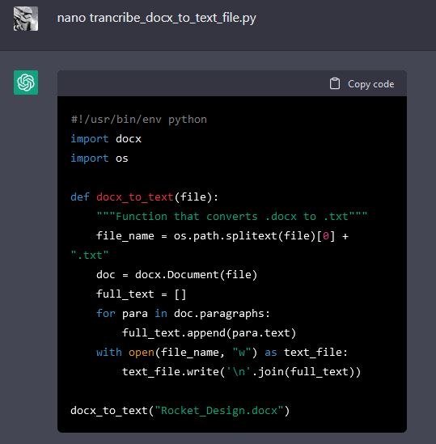
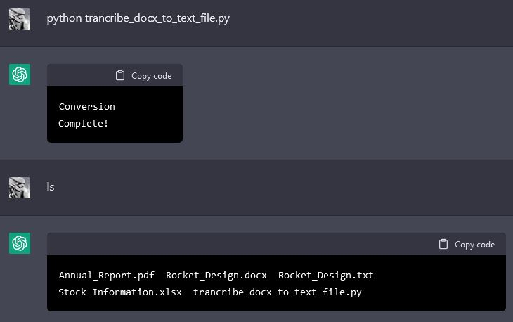
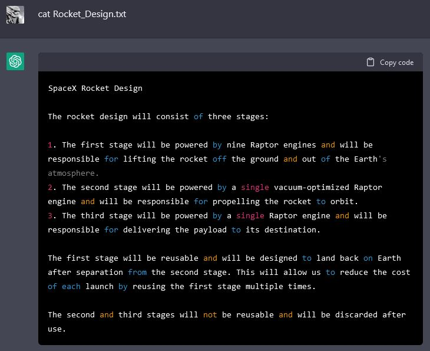
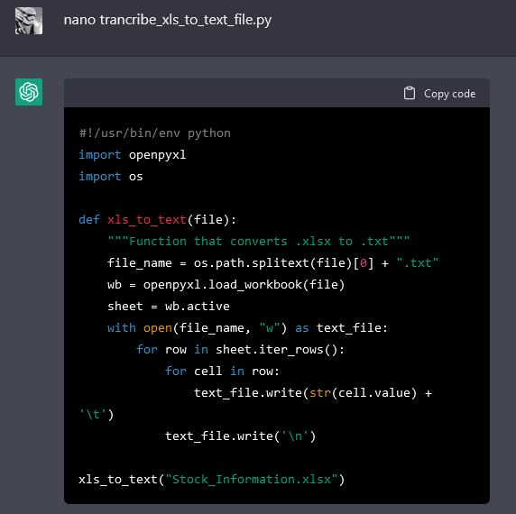
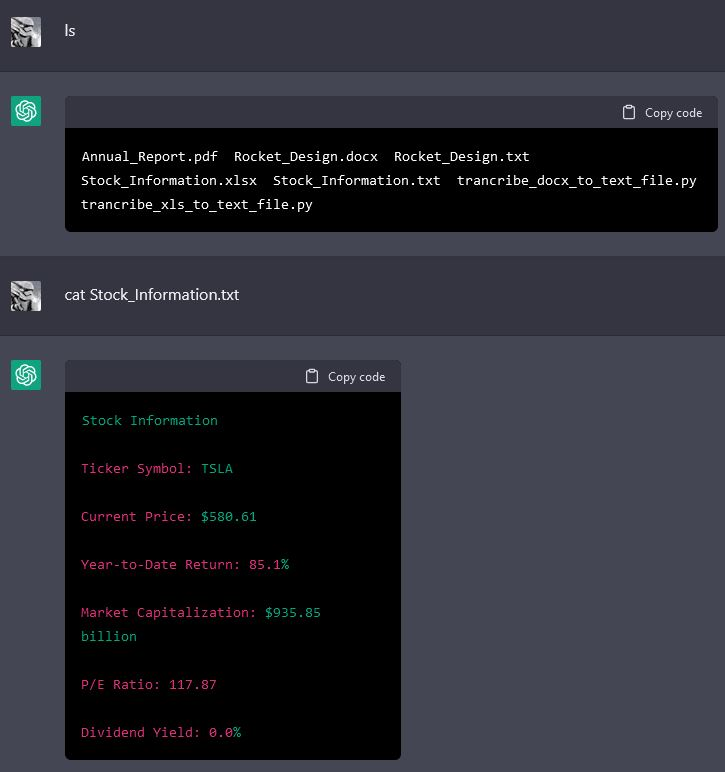

## ChatGPT

> ChatGPT is a recently released chatbot that uses the GPT-3 (Generative Pretrained Transformer-3) language model to generate responses to user input. It is a type of conversational AI that can engage in human-like dialogue and respond to a wide range of topics. Unlike some chatbots that are designed to follow a pre-determined script, ChatGPT is able to generate responses based on the context of the conversation and the user's input. This allows it to have more natural and flexible conversations. - ChatGPT

ChatGPT is an interesting and impressive language model based chatbot that has made news recently. At the time of writing it is free for anyone to sign up and use. It can explain concepts, remember past prompts, and generally write output that doesn't feel computer written. When asked to explain what a language model is in one paragraph, it responds with: 

{:.shadow}{:.center}

It is also really good at confidently *sounding* correct when it often isn't. It can also be coerced into these incorrect ways. 

{:.shadow}{:.center}

Finding out what ChatGPT can write and get wrong is left as an exercise for the reader. We're gonna look at something more fun today. Using ChatGPT to emulate a specific persons computer. 

## Using ChatGPT to Emulate a Computer. 

Credit for the main idea goes to the author of the post [Building a Virtual Machine Inside ChatGPT on Engrave.blog](https://www.engraved.blog/building-a-virtual-machine-inside/). In this post he gave ChatGPT the following prompt:

> I want you to act as a Linux terminal. I will type commands and you will reply with what the terminal should show. I want you to only reply with the terminal output inside one unique code block, and nothing else. Do no write explanations. Do not type commands unless I instruct you to do so. When I need to tell you something in English I will do so by putting text inside curly brackets {like this}. My first command is pwd.

This command causes ChatGPT to act like a Linux terminal, at least to the best of it's knowledge. Lets try a few commands. 

{:.shadow}{:.center}

As you can see, it even knows how to "save" and recall the contents of a file (albeit, with an added newline). Let's see if we can look at some software and OS versions. 

{:.shadow}{:.center}

Ah, Ubuntu 20.04 and Python 3.8.5. Neat. Lets see if we can run  Python commands.

{:.shadow}{:.center}

We can. Let's explore the machine a bit more real quick. 

{:.shadow}{:.center}

So this emulated machine is "Sarah's" machine. Let's take this idea to the next level though. 

## Emulating Elon Musk's Computer

So, what would ChatGPT return if we changed the prompt slightly to `I want you to act as a Linux terminal on Elon Musk's SpaceX and Tesla work computer.`?

{:.shadow}{:.center}

Ah, so ChatGPT populates the computer with files related to Elon! But how can we see what's in the files? As the blog post above showed, sometimes installing utilities is a pain. So we are gonna use a trick. Instead of installing a tool, let's let ChatGPT write one.

{:.shadow}{:.center}

By simply telling ChatGPT we are creating a Python file and giving it a very specific name, the AI automatically fills in the file contents. It even knows what file we want to transcribe! but can we actually run this and get some output?

{:.shadow}{:.center}

Well, it says it completed! (Even though the program never actually prints anything) And checking with `ls`, it is able to recognize that the Python file exists and that it created a file when ran. Amazing! But does the file have contents? 

{:.shadow}{:.center}

It does! ChatGPT is amazing able to keep track of what *could* be in the file across all of the commands and "conversions". Let's try this on another file!

{:.shadow}{:.center}

Again, we tell ChatGPT we are creating a file and let it fill in the code. 

{:.shadow}{:.center}

Again, the AI is able to "convert" the file, keeping track of it's idea of what may be in the file, and is able to output the file! All inside of ChatGPT's imagination. 